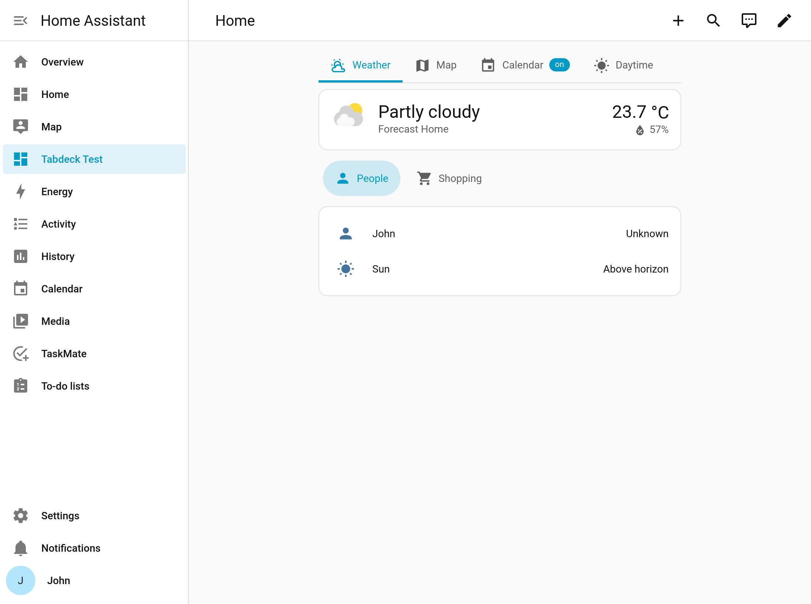
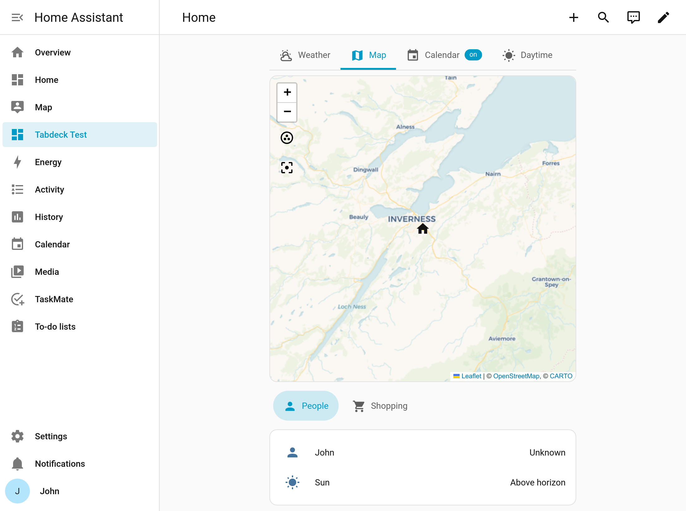

# Tabdeck Card

A modern tabbed card for Home Assistant Lovelace dashboards — organize multiple
cards into clean, themeable tabs with a visual editor, conditional tabs, badges,
and persistent / deep-linkable selection.

Built from the ground up in Lit with **zero external UI-component dependencies**,
so it does not collide with Home Assistant's own components (a common source of
breakage in older tabbed cards after HA frontend updates).



A nested map card rendering correctly the moment its tab is selected — no
"navigate away and back" workaround needed:



## Features

- **Visual GUI editor** — add, remove, reorder and name tabs without YAML.
- **Keep-alive content** — every tab's card stays mounted, so maps, camera /
  picture-glance and graph cards render correctly without navigating away first.
- **Styling & positioning** — `top` / `bottom` / `left` / `right` tab bars in
  `underline`, `pill`, or `segmented` styles, with optional per-tab accent.
- **Conditional tabs** — show or hide a tab based on entity state.
- **Badges** — show an entity's state as a badge on a tab.
- **Persistence & deep-linking** — remember the last tab per browser, or sync the
  active tab to a `#tab=` URL hash so tabs are linkable.
- **Accessible** — proper `tablist` semantics and full keyboard navigation
  (Arrow keys, Home / End).

## Installation (HACS)

1. HACS → Frontend → ⋮ → **Custom repositories** → add
   `https://github.com/tempus2016/tabdeck-card` (category: **Lovelace**).
2. Install **Tabdeck Card**.
3. HACS registers the resource automatically at
   `/hacsfiles/tabdeck-card/tabdeck-card.js` (type: **JavaScript Module**).

### Manual installation

1. Download `tabdeck-card.js` from the latest release.
2. Copy it to `config/www/tabdeck-card.js`.
3. Add a dashboard resource: **Settings → Dashboards → ⋮ → Resources → Add**,
   URL `/local/tabdeck-card.js`, type **JavaScript Module**.

## Example

```yaml
type: custom:tabdeck-card
default_tab: Lights
position: top
style: underline
remember: url
tabs:
  - name: Lights
    icon: mdi:lightbulb
    accent: "#ffcc00"
    card:
      type: light
      entity: light.kitchen
  - name: Climate
    icon: mdi:thermostat
    badge: sensor.living_room_temperature
    card:
      type: thermostat
      entity: climate.living_room
  - name: Guests
    icon: mdi:account-group
    visibility:
      - condition: state
        entity: input_boolean.guest_mode
        state: "on"
    card:
      type: entities
      entities:
        - light.guest_room
```

## Options

### Card options

| Option        | Type              | Default      | Description |
|---------------|-------------------|--------------|-------------|
| `type`        | string            | —            | `custom:tabdeck-card` (required). |
| `tabs`        | list              | —            | One or more tab objects (required). |
| `default_tab` | number \| string  | `0`          | Index or tab `name` shown first. Overridden by persistence. |
| `position`    | string            | `top`        | `top` \| `bottom` \| `left` \| `right`. |
| `style`       | string            | `underline`  | `underline` \| `pill` \| `segmented`. |
| `scrollable`  | `auto` \| boolean | `auto`       | Scroll the tab bar when tabs overflow. |
| `remember`    | string            | `none`       | `none` \| `browser` \| `url`. |
| `lazy`        | boolean           | `false`      | Create inactive tab cards on first visit instead of up front. |
| `styles`      | object            | `{}`         | CSS-variable overrides (see Theming). |

### Tab options

| Option       | Type   | Default | Description |
|--------------|--------|---------|-------------|
| `name`       | string | —       | Tab label; also the id used by `default_tab` and `#tab=`. |
| `icon`       | string | —       | Optional `mdi:` icon. |
| `accent`     | string | —       | Optional per-tab accent color (any CSS color). |
| `badge`      | string | —       | Entity id whose state is shown as a badge. |
| `visibility` | list   | —       | Conditions (see below); the tab is hidden when unmet. |
| `card`       | object | —       | Any Lovelace card config (required). |

### Visibility conditions

Supported condition types in v1: `state`, `numeric_state`, and `screen`.
(Template conditions are planned for a later release.)

```yaml
visibility:
  - condition: state
    entity: input_boolean.guest_mode
    state: "on"
  - condition: numeric_state
    entity: sensor.temperature
    above: 18
    below: 26
```

## Theming

The card inherits your Home Assistant theme by default. Fine-tune via CSS
variables (set globally in your theme, or per-card under `styles`):

| Variable                  | Purpose                          |
|---------------------------|----------------------------------|
| `--tabdeck-accent`        | Active tab / indicator color.    |
| `--tabdeck-tab-height`    | Height of the tab bar.           |
| `--tabdeck-tab-font-size` | Tab label font size.             |

## Editor

The visual editor lets you manage tabs (add / delete / reorder), set each tab's
name and icon, and choose position, style, and persistence. In this version the
tab's nested **card** is edited as YAML/JSON; native integration with Home
Assistant's built-in card editor is planned.

## Migrating from `tabbed-card`

Tabdeck reads several of the original `kinghat/tabbed-card` keys so existing
configs keep working:

- `options.defaultTabIndex` → `default_tab`
- per-tab `attributes.label` → `name`, `attributes.icon` → `icon`

Update to the new keys when convenient; the new keys win if both are present.

## License

MIT © 2026 John Mackinnon
