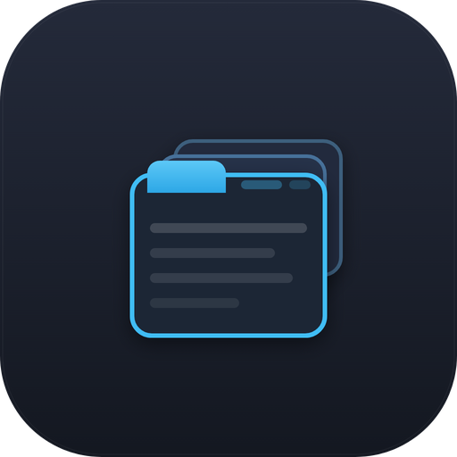

<p align="center">
  
</p>

<h1 align="center">Tabdeck Card</h1>

<p align="center">
  <a href="https://github.com/tempus2016/tabdeck-card/releases"></a>
  <a href="https://github.com/tempus2016/tabdeck-card/releases"></a>
  
  <a href="https://github.com/tempus2016/tabdeck-card/blob/main/LICENSE"></a>
</p>

<p align="center">
  <a href="https://github.com/tempus2016/tabdeck-card/actions/workflows/ci.yml"></a>
  <a href="https://github.com/tempus2016/tabdeck-card/actions/workflows/validate.yml"></a>
  <a href="https://github.com/tempus2016/tabdeck-card/wiki"></a>
</p>

A modern tabbed card for Home Assistant Lovelace dashboards — organize multiple
cards into clean, themeable tabs with a visual editor, conditional tabs, badges,
and persistent / deep-linkable selection.

Built from the ground up in Lit with **zero external UI-component dependencies**,
so it does not collide with Home Assistant's own components (a common source of
breakage in older tabbed cards after HA frontend updates).


A nested map card rendering correctly the moment its tab is selected — no
"navigate away and back" workaround needed:


> 📖 **Full documentation, every option, and screenshots are on the [Wiki](https://github.com/tempus2016/tabdeck-card/wiki).** This README is a quick overview.

## Features

- **Visual GUI editor** — add, remove, **drag-to-reorder**, duplicate and name tabs without YAML; collapsible tab blocks, native HA card editor, duplicate-name warnings.
- **Keep-alive content** (or opt-in `unmount_hidden`) — maps/cameras/graphs render correctly without navigating away.
- **Tab bar styling** — `top`/`bottom`/`left`/`right` positions; `underline`/`pill`/`segmented`/`boxed`/`text` styles; `tab_display` (icon/label/both); `align`; `indicator_size`; `sticky`; `elevation`; `bar_background`; per-tab `accent`/`color`.
- **Per-tab** — `subtitle`, `badge` (text or `dot`, `badge_color`, hide-inactive), `disabled`, multiple `cards`/`columns`, long-press `hold_action`.
- **Dynamic** — conditional `visibility` (`state`/`numeric_state`/`screen`/`time`/`user`/`template` + `and`/`or`/`not`), `auto_select` on entity state, conditional `default_if`.
- **Persistence** — remember the active tab per `browser`, `url` (`#tab=`), or across devices via an `entity`.
- **Transitions** — optional `fade`/`slide` panel animations (respects reduced-motion).
- **Theming** — CSS variables via `styles`, no card-mod needed.
- **Accessible** — `tablist` semantics, full keyboard navigation (Arrows, Home/End, skips disabled).

## Installation (HACS)

1. HACS → Frontend → ⋮ → **Custom repositories** → add
   `https://github.com/tempus2016/tabdeck-card` (category: **Lovelace**).
2. Install **Tabdeck Card**.
3. HACS registers the resource automatically at
   `/hacsfiles/tabdeck-card/tabdeck-card.js` (type: **JavaScript Module**).

### Manual installation

1. Download `tabdeck-card.js` from the latest release.
2. Copy it to `config/www/tabdeck-card.js`.
3. Add a dashboard resource: **Settings → Dashboards → ⋮ → Resources → Add**,
   URL `/local/tabdeck-card.js`, type **JavaScript Module**.

## Example

```yaml
type: custom:tabdeck-card
default_tab: Lights
position: top
style: underline
remember: url
tabs:
  - name: Lights
    icon: mdi:lightbulb
    accent: "#ffcc00"
    card:
      type: light
      entity: light.kitchen
  - name: Climate
    icon: mdi:thermostat
    badge: sensor.living_room_temperature
    card:
      type: thermostat
      entity: climate.living_room
  - name: Guests
    icon: mdi:account-group
    visibility:
      - condition: state
        entity: input_boolean.guest_mode
        state: "on"
    card:
      type: entities
      entities:
        - light.guest_room
```

## Demo

A ready-to-paste dashboard showcasing many features lives in
[`examples/demo.yaml`](examples/demo.yaml).

## Options

> The tables below cover the essentials. See the **[Configuration](https://github.com/tempus2016/tabdeck-card/wiki/Configuration)** wiki page for the complete, always-current reference (every option links to a feature page).

### Card options

| Option        | Type              | Default      | Description |
|---------------|-------------------|--------------|-------------|
| `type`        | string            | —            | `custom:tabdeck-card` (required). |
| `tabs`        | list              | —            | One or more tab objects (required). |
| `default_tab` | number \| string  | `0`          | Index or tab `name` shown first. Overridden by persistence. |
| `position`    | string            | `top`        | `top` \| `bottom` \| `left` \| `right`. |
| `style`       | string            | `underline`  | `underline` \| `pill` \| `segmented` \| `boxed` \| `text`. |
| `tab_display` | string            | `both`       | `both` \| `icon` \| `label`. |
| `align`       | string            | `start`      | `start` \| `center` \| `end` \| `justify`. |
| `indicator_size` | number         | `3`          | Underline thickness (1–16 px). |
| `accent_indicator` | boolean      | `true`       | Colour the indicator by the selected tab's accent. |
| `badge_display` | string          | `text`       | `text` \| `dot`. |
| `hide_inactive_badge` | boolean   | `false`      | Hide 0/off badges. |
| `transition`  | string            | `none`       | Panel switch animation: `none` \| `fade` \| `slide`. |
| `sticky` / `elevation` | boolean  | `false`      | Pin the bar / raise it with a shadow. |
| `bar_background` | string         | —            | Custom tab-bar background colour. |
| `header`      | boolean           | `false`      | Show the active tab's title above the content. |
| `unmount_hidden` | boolean        | `false`      | Keep only the active tab's card in the DOM. |
| `scrollable`  | `auto` \| boolean | `auto`       | Scroll the tab bar when tabs overflow. |
| `remember`    | string            | `none`       | `none` \| `browser` \| `url` \| `entity` (+ `remember_entity`, `storage_key`). |
| `swipe_wrap`  | boolean           | `false`      | Swipe wraps around the ends. |
| `lazy`        | boolean           | `false`      | Create inactive tab cards on first visit instead of up front. |
| `animated`    | boolean           | `true`       | Slide the active-tab indicator between tabs. Snaps instantly when `false` or under reduced-motion. |
| `swipe`       | boolean           | `false`      | Change tabs by swiping left/right on the card body (touch devices). Off by default so it never hijacks gestures of interactive cards (maps, sliders). |
| `styles`      | object            | `{}`         | CSS-variable overrides (see Theming). |

### Tab options

| Option       | Type   | Default | Description |
|--------------|--------|---------|-------------|
| `name`       | string | —       | Tab label; also the id used by `default_tab` and `#tab=`. |
| `subtitle`   | string | —       | Secondary text under the label. |
| `icon`       | string | —       | Optional `mdi:` icon. |
| `accent`     | string | —       | Per-tab accent (indicator + selected state). |
| `color`      | string | —       | Fixed label/icon colour for the tab. |
| `badge` / `badge_color` | string | — | Entity id or Jinja template; optional badge colour. |
| `disabled`   | boolean | `false` | Show greyed-out and non-selectable. |
| `hold_action` | action | —      | HA action fired on long-press (tap still selects). |
| `auto_select` | string \| object | — | Switch to this tab when an entity becomes active. |
| `default_if` | list   | —       | Conditions that make this the default tab on load. |
| `visibility` | list   | —       | Conditions (see below); the tab is hidden when unmet. |
| `card` / `cards` / `columns` | object/list/number | — | A single card, or multiple `cards` (optionally in a `columns` grid). |

### Visibility conditions

Supported condition types: `state`, `numeric_state`, `screen`, `time`, `user`, `template`, and `and`/`or`/`not` groups (nestable). See the [Tab Visibility](https://github.com/tempus2016/tabdeck-card/wiki/Tab-Visibility) wiki page.

```yaml
visibility:
  - condition: state
    entity: input_boolean.guest_mode
    state: "on"
  - condition: numeric_state
    entity: sensor.temperature
    above: 18
    below: 26
  - condition: template
    value_template: "{{ is_state('alarm_control_panel.home', 'armed_away') }}"
```

### Templates

Both `badge` and `template` visibility conditions accept Jinja templates,
rendered server-side by Home Assistant and updated live. A tab with a
template visibility condition stays hidden until the template first renders
truthy (and is hidden again if the template errors).

## Theming

The card inherits your Home Assistant theme by default. Fine-tune via CSS
variables (set globally in your theme, or per-card under `styles`):

| Variable                  | Purpose                          |
|---------------------------|----------------------------------|
| `--tabdeck-accent`        | Active tab / indicator color.    |
| `--tabdeck-tab-height`    | Height of the tab bar.           |
| `--tabdeck-tab-font-size` | Tab label font size.             |

## Editor

The visual editor lets you manage tabs (add / delete / **drag-to-reorder** /
duplicate), with collapsible per-tab blocks and a card-type chooser that drills
into Home Assistant's **native card editor**. Each tab exposes name, subtitle,
icon, accent, colour, badge and long-press action; global controls cover every
top-level option. It warns about footguns like duplicate tab names. See the
[Editor](https://github.com/tempus2016/tabdeck-card/wiki/Editor) wiki page.

## Migrating from `tabbed-card`

Tabdeck reads several of the original `kinghat/tabbed-card` keys so existing
configs keep working:

- `options.defaultTabIndex` → `default_tab`
- per-tab `attributes.label` → `name`, `attributes.icon` → `icon`

Update to the new keys when convenient; the new keys win if both are present.

## License

MIT © 2026 John Mackinnon
