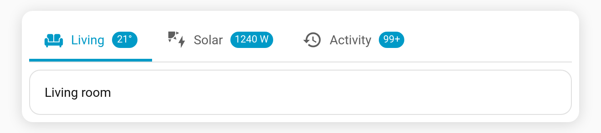

# Badges

A badge is a small piece of text shown on a tab — perfect for unread counts, alarm states, or "X on" summaries.

## Entity badge

Set `badge` to an entity id and the badge shows that entity's **state**:

```yaml
tabs:
  - name: Inbox
    icon: mdi:email
    badge: sensor.unread_count
    card: { ... }
```

## Template badge

Set `badge` to a Jinja template (anything containing `{{` or `{%`) and it is rendered live over the HA websocket:

```yaml
tabs:
  - name: Lights
    icon: mdi:lightbulb-group
    badge: >-
      {{ states.light | selectattr('state','eq','on') | list | count }}
    card: { ... }
```

## Behaviour notes

- A plain string that is neither an entity id nor a template is shown verbatim.
- An empty or unresolved template renders no badge (rather than `unknown`).
- Template badges update automatically when their inputs change.

## Numeric formatting: `badge_format`

Numeric badges can be rounded, capped and given a unit. Set `badge_format` on a tab, or at the top level as a default for every tab (a tab's own `badge_format` wins).

| Key | Type | Effect |
| --- | --- | --- |
| `precision` | integer 0–6 | Round to this many decimal places (`21.456` → `21.5` with `1`). |
| `max` | number | Values above it show as `<max>+` (`150` → `99+` with `99`). |
| `unit` | string | Appended to the value (include a leading space if you want one: `" W"`). |

```yaml
type: custom:tabdeck-card
badge_format: { max: 99 }          # default: cap every count at 99+
tabs:
  - name: Living
    badge: sensor.living_room_temperature
    badge_format: { precision: 0, unit: "°" }
    card: { ... }
  - name: Solar
    badge: sensor.solar_power
    badge_format: { unit: " W", max: 9999 }
    card: { ... }
  - name: Activity
    badge: sensor.activity_count  # 485 → 99+ via the top-level default
    card: { ... }
```



- Non-numeric values (`on`, `Open`, …) are shown unchanged.
- With `badge_display: dot`, no text is shown, so formatting doesn't apply.
- Any numeric zero (`0`, `0.0`, `-0`) counts as *inactive*, so [`hide_inactive_badge`](Feature-Hide-Inactive-Badge) hides it and dot mode shows no dot.
