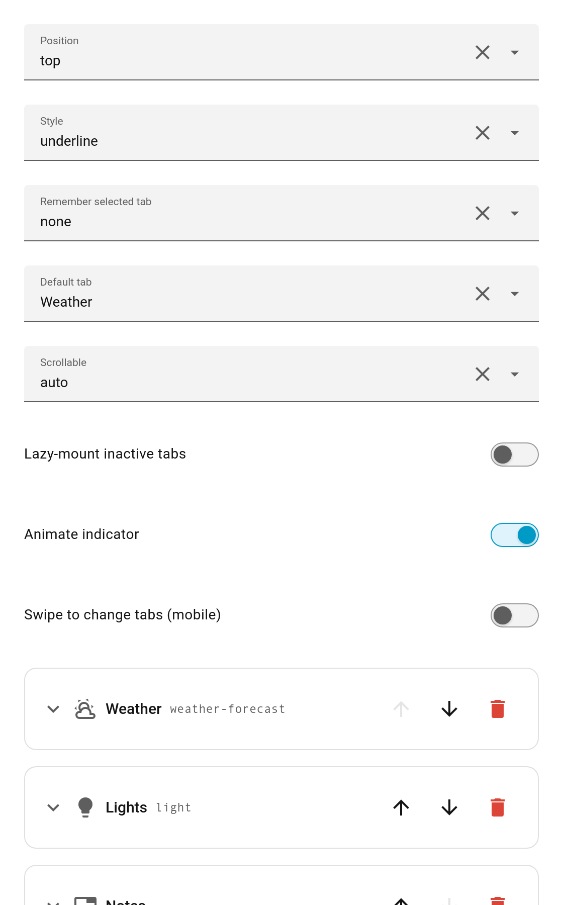
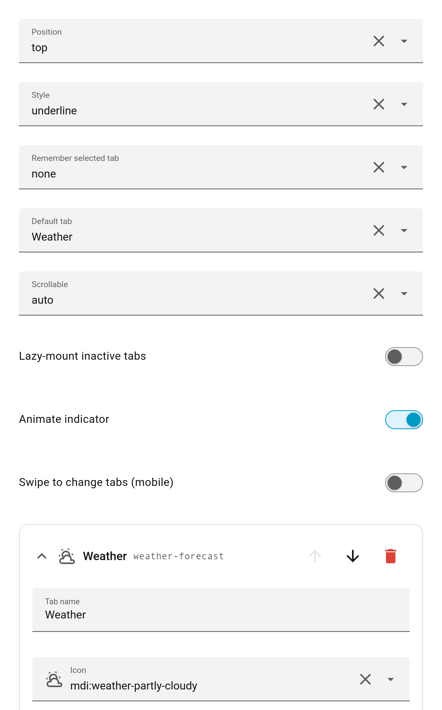

# The Visual Editor

Tabdeck ships a full GUI editor built on Home Assistant's own `ha-form`, so it matches your HA theme and version.

## Global options

The top of the editor exposes every [top-level option](Configuration#top-level-options): position, style, remember mode, default tab, scrollable, lazy, animate, swipe.

## Per-tab blocks

Each tab is a collapsible block. By default every block is **collapsed** to save space; the header shows the tab's icon, name, and card type. Click a header (or focus it and press <kbd>Enter</kbd>/<kbd>Space</kbd>) to expand it and edit:

- **Tab name**
- **Icon** — HA's searchable icon picker with live previews
- **Accent colour**
- **Badge** — entity id or template
- **Edit card** — drills into HA's native card editor (visual + YAML)

### Reordering, deleting, adding

Each header has **move up / move down / delete** buttons. The **Add tab** button at the bottom appends a new, typeless tab — its drill-in shows a **card-type chooser** so you can pick (or type) any card type, including `custom:` cards.

## Notes

- A newly added tab starts with no card type; choose one in the drill-in. The live preview shows a "No card type configured" placeholder until you do — this is expected and matches native HA.
- The editor never hard-codes HA element names; it uses `ha-form` selectors so it keeps working across HA frontend versions.
