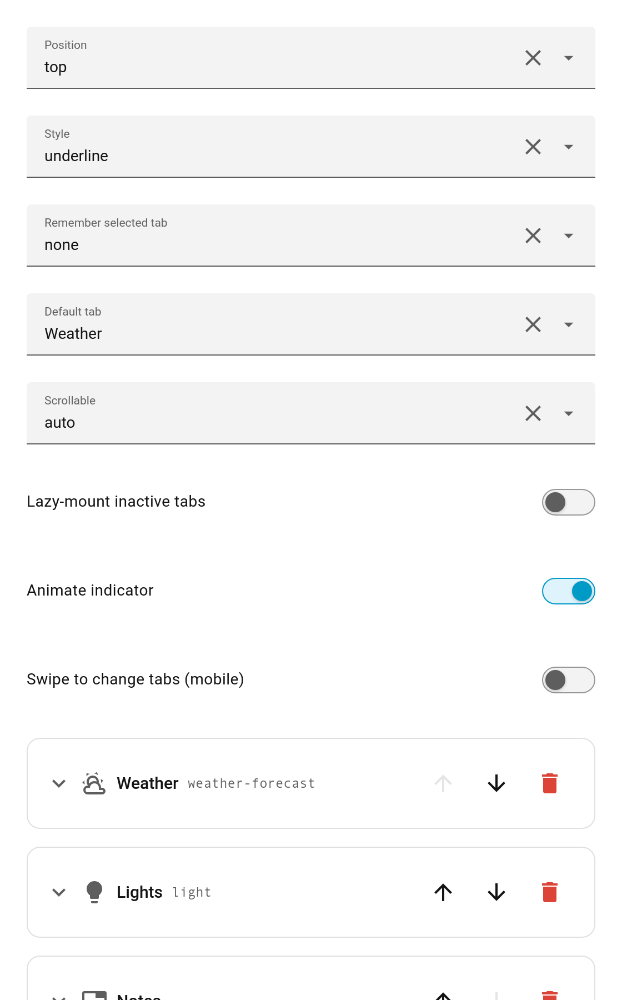
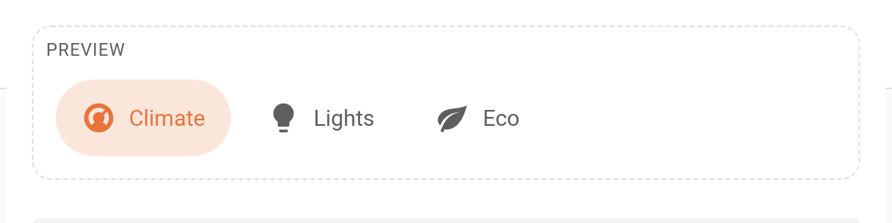
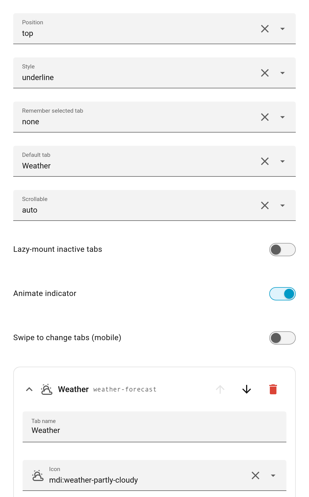
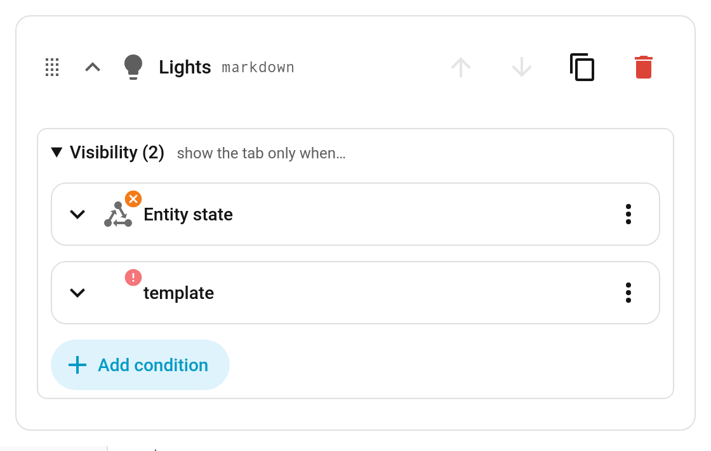
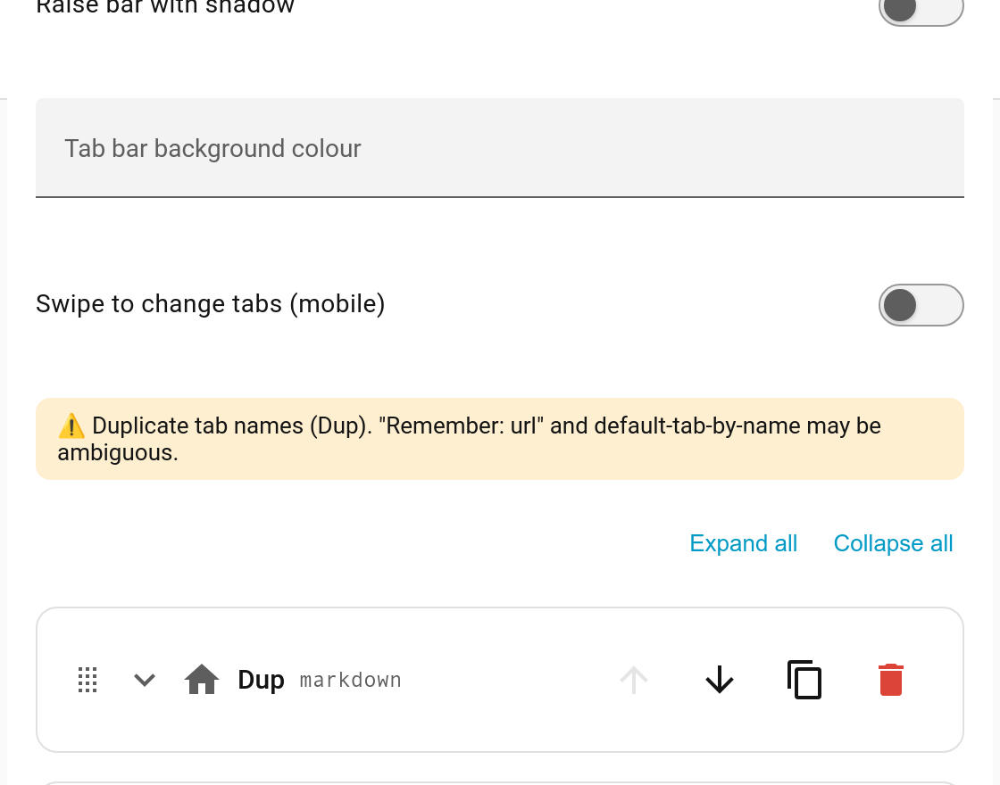

# The Visual Editor

Tabdeck ships a full GUI editor built on Home Assistant's own `ha-form`, so it matches your HA theme and version.

## Live preview

A non-interactive **Preview** strip at the top of the editor shows the tab bar with your current tabs, icons, accents, style, display mode and alignment — it updates live as you edit.

## Global options

The top of the editor exposes every [top-level option](Configuration#top-level-options): position, style, remember mode, default tab, scrollable, lazy, animate, swipe.

## Per-tab blocks

Each tab is a collapsible block. By default every block is **collapsed** to save space; the header shows the tab's icon, name, and card type. Click a header (or focus it and press <kbd>Enter</kbd>/<kbd>Space</kbd>) to expand it and edit:

- **Tab name**
- **Icon** — HA's searchable icon picker with live previews
- **Accent colour**
- **Badge** — entity id or template
- **Actions** — tap / long-press / badge / enter / leave actions via HA's action picker
- **Visibility**, **Alert**, **Default when** — condition builders (see below)
- **Edit card** — drills into HA's native card editor (visual + YAML)

### Condition builders

Below the tab's fields are three collapsible sections, each showing its condition count:

| Section | Edits | Meaning |
| --- | --- | --- |
| **Visibility** | `visibility` | Show the tab only when… ([Tab Visibility](Tab-Visibility)) |
| **Alert** | `alert` | Pulse the tab when… ([Alert pulse](Feature-Alert)) |
| **Default when** | `default_if` | Start on this tab when… ([Conditional default](Feature-Conditional-Default)) |

They use **Home Assistant's own condition editor**, the same one as a card's *Visibility* tab. You can add *Entity state*, *Entity numeric state*, *Screen*, *User*, *Time* and *And/Or/Not* groups visually, test each condition live, and reorder, duplicate or delete them. Tabdeck-only types such as `template` show as editable **YAML** inside the same list. Removing every condition removes the key.

If HA's condition editor isn't available (an unusual frontend build), the section falls back to a YAML editor, or failing that a JSON text box.

### Reordering, deleting, adding

Each header has a **drag handle** (the grip icon) — drag a tab to reorder it — plus **move up / move down / duplicate / delete** buttons.

### Warnings

The editor shows a warning when it spots a footgun, e.g. **duplicate tab names** (which make `remember: url` and default-tab-by-name ambiguous). The **Add tab** button at the bottom appends a new, typeless tab — its drill-in shows a **card-type chooser** so you can pick (or type) any card type, including `custom:` cards.

## Notes

- A newly added tab starts with no card type; choose one in the drill-in. The live preview shows a "No card type configured" placeholder until you do — this is expected and matches native HA.
- The editor never hard-codes HA element names; it uses `ha-form` selectors so it keeps working across HA frontend versions.
