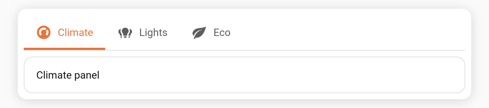

# Accent-coloured indicator

Give each tab its own `accent` colour and the **selection indicator, icon, and label adopt that colour** when the tab is active. Turn it off for a single theme-coloured indicator.

**Config key:** `accent_indicator` (top-level boolean, default `true`) · **Per-tab:** `accent` (CSS colour)

```yaml
type: custom:tabdeck-card
accent_indicator: true        # default; set false for a uniform indicator
tabs:
  - name: Climate
    icon: mdi:thermostat
    accent: "#e8743b"
    card: { type: thermostat, entity: climate.living_room }
  - name: Lights
    icon: mdi:lightbulb-group
    accent: "#3b82e8"
    card: { type: entities, entities: [light.kitchen] }
  - name: Eco
    icon: mdi:leaf
    accent: "#2faa54"
    card: { type: entities, entities: [sensor.power] }
```



## Behaviour

- When `accent_indicator: true` (default), the moving indicator takes the **selected** tab's `accent`. As you switch tabs the colour follows.
- A tab without an `accent` falls back to the theme's `--primary-color`.
- When `accent_indicator: false`, the indicator is always `--primary-color`, regardless of per-tab accents.
- Works with all three bar [styles](Configuration) (`underline`, `pill`, `segmented`).

Toggle it from the **Colour indicator by tab accent** switch in the [visual editor](Editor).
