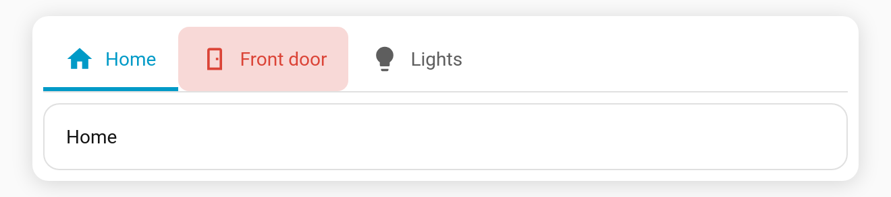

# Alert pulse

Give a tab **`alert`** conditions, and it **pulses** in the alert colour while they're met. This draws the eye to something that needs attention, like a door left open, a leak, or a freezer that's too warm, even when you're on another tab.

**Per-tab key:** `alert`, a list of conditions using the same syntax as [`visibility`](Tab-Visibility) (`state`, `numeric_state`, `screen`, `time`, `user`, `template`, `and`/`or`/`not`). All must be met.

```yaml
type: custom:tabdeck-card
tabs:
  - name: Home
    icon: mdi:home
    card: { ... }
  - name: Front door
    icon: mdi:door
    alert:
      - condition: state
        entity: binary_sensor.front_door
        state: "on"
    card: { ... }
  - name: Freezer
    icon: mdi:fridge
    alert:
      - condition: numeric_state
        entity: sensor.freezer_temperature
        above: -12
    card: { ... }
```



## "Open for more than 5 minutes"

Duration checks go through a `template` condition:

```yaml
alert:
  - condition: template
    value_template: >-
      {{ is_state('binary_sensor.front_door', 'on') and
         (now() - states.binary_sensor.front_door.last_changed).total_seconds() > 300 }}
```

## Styling

| Variable | Default | Effect |
| --- | --- | --- |
| `--tabdeck-alert-color` | `var(--error-color)` | Pulse tint and label/icon colour. |
| `--tabdeck-alert-radius` | `8px` | Corner radius of the pulse. |

Set them with [`styles`](Feature-Theming), e.g. `styles: { --tabdeck-alert-color: orange }`.

## Behaviour

- The tab keeps working normally (tap to select); the pulse is only visual.
- Under **reduced motion** the pulse becomes a steady tint.
- A per-tab [`color`](Feature-Tab-Color) overrides the alert's label/icon colour, but the tint still pulses.
