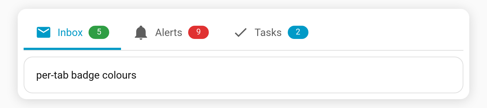

# Per-tab badge colour

Give a tab's [badge](Badges) its own colour — e.g. green for unread, red for alerts.

**Per-tab key:** `badge_color` (CSS colour)

```yaml
type: custom:tabdeck-card
tabs:
  - name: Inbox
    icon: mdi:email
    badge: sensor.unread
    badge_color: "#2f9e44"
    card: { ... }
  - name: Alerts
    icon: mdi:bell
    badge: sensor.alerts
    badge_color: "#e03131"
    card: { ... }
```



## Notes

- `badge_color` colours both the text badge and the [dot](Feature-Badge-Display) variant.
- Without it, badges use the tab's [`accent`](Feature-Accent-Indicator) (or the theme primary colour).
- Set it from the **Badge colour** field in the [visual editor](Editor).
