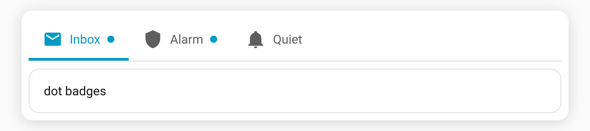

# Badge display mode

Show [badges](Badges) as their **text value** (the default) or as a small **dot** that only appears when the badge is "active". The dot is perfect for "has activity" indicators where the exact number doesn't matter.

**Config key:** `badge_display` (top-level) · **Values:** `text` (default) · `dot`

```yaml
type: custom:tabdeck-card
badge_display: dot
tabs:
  - name: Inbox
    icon: mdi:email
    badge: sensor.unread_count   # dot shows when > 0
    card: { ... }
  - name: Alarm
    icon: mdi:shield
    badge: binary_sensor.alarm   # dot shows when "on"
    card: { ... }
```



## When is the dot shown?

In `dot` mode the dot appears when the resolved badge value is **active** — i.e. anything except these (case-insensitive):

`""`, `0`, `off`, `false`, `no`, `none`, `unavailable`, `unknown`, `closed`

So `binary_sensor` `on`/`off`, counts like `3`/`0`, and door `open`/`closed` all behave sensibly. In `text` mode the badge always shows its literal value (current behaviour).

The dot uses the tab's [`accent`](Feature-Accent-Indicator) colour. Pick the mode from the **Badge display** dropdown in the [visual editor](Editor).
