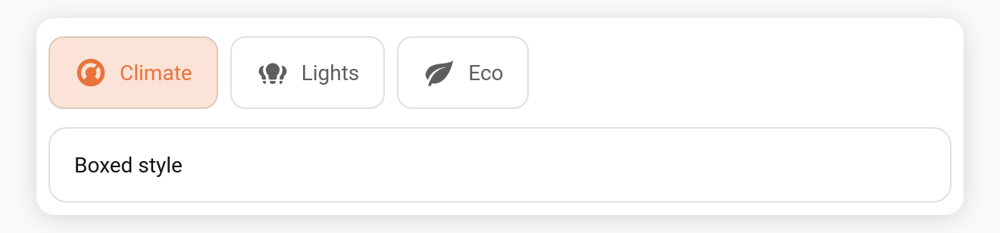
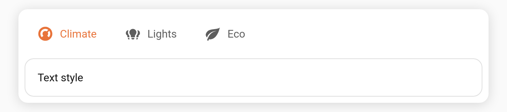

# Extra bar styles: `boxed` and `text`

In addition to `underline`, `pill`, and `segmented`, Tabdeck offers two more bar [styles](Configuration).

**Config key:** `style` (top-level) · **New values:** `boxed` · `text`

## `boxed`

Each tab is its own bordered chip; the selected chip gets a tinted [accent](Feature-Accent-Indicator) fill.

```yaml
type: custom:tabdeck-card
style: boxed
tabs:
  - { name: Climate, icon: mdi:thermostat, accent: "#e8743b", card: { ... } }
  - { name: Lights, icon: mdi:lightbulb-group, card: { ... } }
  - { name: Eco, icon: mdi:leaf, card: { ... } }
```



## `text`

No indicator and no borders — the selected tab is shown purely by colouring its label/icon. The most minimal look.

```yaml
type: custom:tabdeck-card
style: text
tabs: [ ... ]
```



## Notes

- Both styles respect [`accent_indicator`](Feature-Accent-Indicator) and per-tab `accent`.
- Pick the style from the **Style** dropdown in the [visual editor](Editor).
