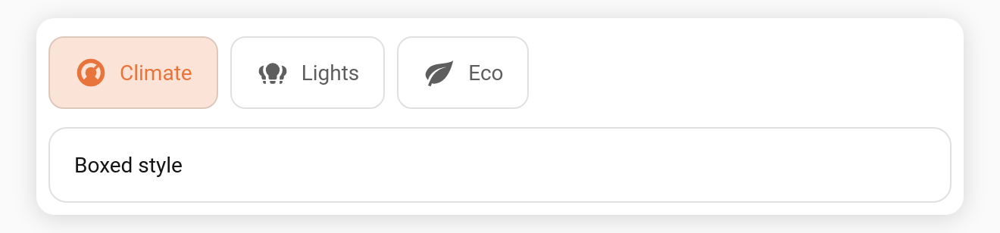
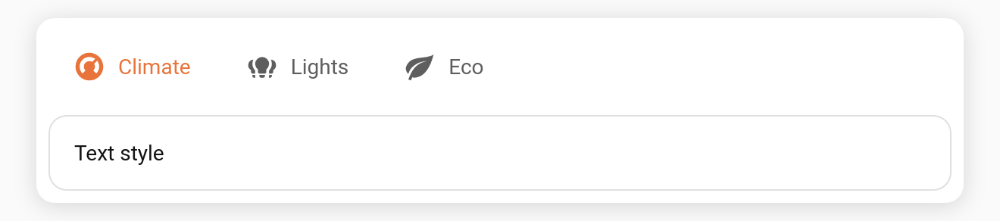
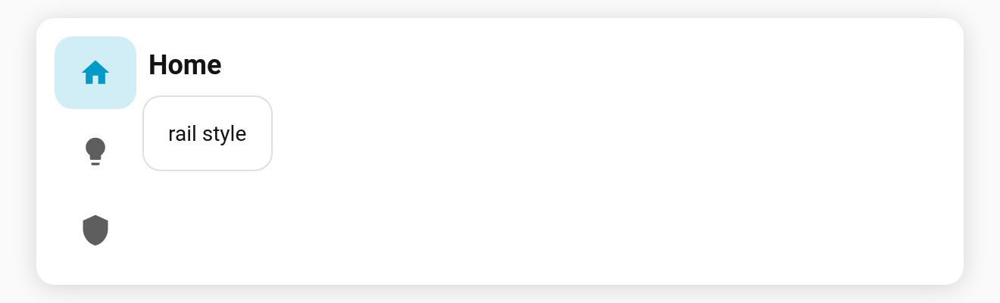
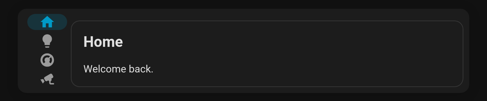
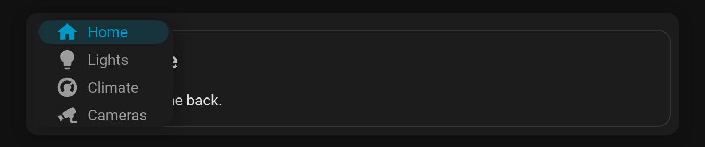

# Extra bar styles: `boxed` and `text`

In addition to `underline`, `pill`, and `segmented`, Tabdeck offers two more bar [styles](Configuration).

**Config key:** `style` (top-level) · **New values:** `boxed` · `text`

## `boxed`

Each tab is its own bordered chip; the selected chip gets a tinted [accent](Feature-Accent-Indicator) fill.

```yaml
type: custom:tabdeck-card
style: boxed
tabs:
  - { name: Climate, icon: mdi:thermostat, accent: "#e8743b", card: { ... } }
  - { name: Lights, icon: mdi:lightbulb-group, card: { ... } }
  - { name: Eco, icon: mdi:leaf, card: { ... } }
```



## `text`

No indicator and no borders — the selected tab is shown purely by colouring its label/icon. The most minimal look.

```yaml
type: custom:tabdeck-card
style: text
tabs: [ ... ]
```



## `rail`

A compact **icon rail** — centred tabs with a rounded selection highlight. Designed to pair with `position: left`/`right` and `tab_display: icon` (often with [`header`](Feature-Header) for the active title).

```yaml
type: custom:tabdeck-card
position: left
style: rail
tab_display: icon
header: true
tabs: [ ... ]
```



## Indicator corner radius

`indicator_radius` (px) overrides the corner radius of the `pill`/`segmented`/`boxed`/`rail` indicator — e.g. `indicator_radius: 4` for a squarer highlight, `0` for sharp corners.

## Notes

- All styles respect [`accent_indicator`](Feature-Accent-Indicator) and per-tab `accent`.
- Pick the style from the **Style** dropdown in the [visual editor](Editor).


## Expanding side rail (`rail_expand`)

For `position: left` or `right`, **`rail_expand: true`** keeps the bar as a slim icon rail. Hovering it, or moving keyboard focus into it, slides the labels out **over** the content, so nothing reflows. Moving away collapses it again.

```yaml
type: custom:tabdeck-card
position: left
style: rail
rail_expand: true
tabs: [ ... ]
```

| Collapsed | Hovered |
|---|---|
|  |  |

Set the collapsed width with `--tabdeck-rail-width` (default 64px). It has no effect on top or bottom bars.
