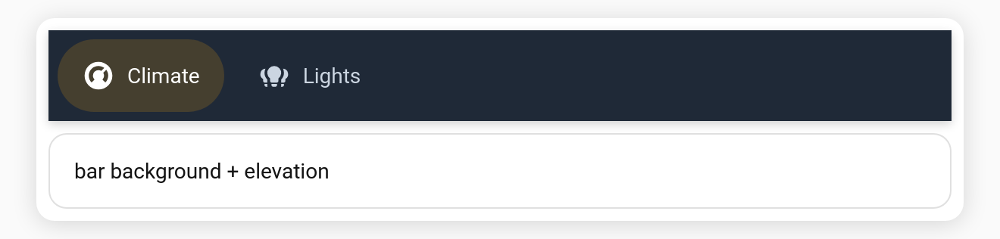

# Tab bar background & elevation

Give the tab bar its own surface — a custom background colour and/or a subtle drop shadow that lifts it off the card.

**Config keys:** `bar_background` (CSS colour) · `elevation` (boolean, default `false`)

```yaml
type: custom:tabdeck-card
style: pill
bar_background: "#1f2937"
elevation: true
tabs:
  - name: Climate
    icon: mdi:thermostat
    color: "#ffffff"          # readable text on the dark bar
    accent: "#f59e0b"
    card: { ... }
```



## Notes

- `bar_background` accepts any CSS colour (hex, `rgb()`, `var(--…)`).
- `elevation` adds `--tabdeck-bar-shadow` (default `0 2px 6px rgba(0,0,0,.18)`) — override it via [`styles`](Feature-Theming).
- Pair with per-tab [`color`](Feature-Tab-Color) so labels stay readable on a dark bar.
- Both are in the visual editor (**Tab bar background colour**, **Raise bar with shadow**).
