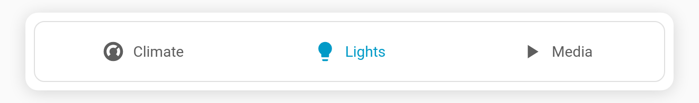

# Collapsible deck

With **`collapsible: true`**, tapping the **already-active** tab folds the content away and leaves just the tab bar. Tap it again, or pick any other tab, to open it back up. This helps on phones, where a tall deck can push everything else off screen.

**Config keys:** `collapsible` (boolean, default `false`), `start_collapsed` (boolean, default `false`, only with `collapsible`)

```yaml
type: custom:tabdeck-card
collapsible: true
start_collapsed: true    # open the dashboard with only the bar showing
style: segmented
align: justify
tabs:
  - name: Climate
    icon: mdi:thermostat
    card: { ... }
  - name: Lights
    icon: mdi:lightbulb
    card: { ... }
```



## Behaviour

- **Active tab tapped** → folds or unfolds. **Another tab chosen** (tap, keyboard, auto-select, …) → unfolds and switches.
- While folded, the selection indicator is dimmed, and the card reports a size of 1 row to masonry layouts.
- The folded state isn't remembered. It resets to `start_collapsed` on reload.
- Both options are toggles in the visual editor.
