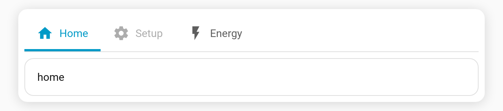

# Disabled tabs

Show a tab greyed-out and non-selectable instead of [hiding it](Tab-Visibility). Useful for "coming soon" tabs or to indicate a feature that's temporarily unavailable.

**Per-tab key:** `disabled` (boolean)

```yaml
type: custom:tabdeck-card
tabs:
  - name: Home
    icon: mdi:home
    card: { ... }
  - name: Setup
    icon: mdi:cog
    disabled: true        # visible but greyed out
    card: { ... }
  - name: Energy
    icon: mdi:flash
    card: { ... }
```



## Behaviour

- A disabled tab is rendered at reduced opacity and **cannot be clicked**.
- **Keyboard** navigation skips disabled tabs, and <kbd>Home</kbd>/<kbd>End</kbd> land on the first/last *enabled* tab.
- Difference from [visibility](Tab-Visibility): visibility **removes** a tab from the bar; `disabled` **keeps it visible** but inert.
- Toggle it from the **Disable tab** switch in the [visual editor](Editor).
