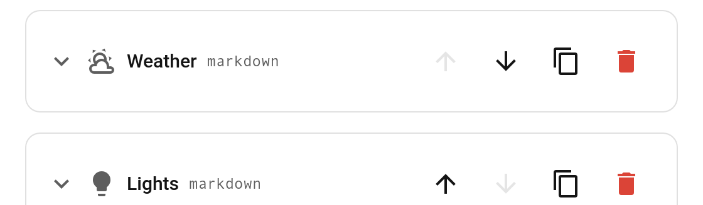

# Duplicate tab (editor)

Each tab block in the [visual editor](Editor) has a **duplicate** button (the copy icon, between *move down* and *delete*). Click it to insert a deep copy of that tab right after the original — its whole card and settings come along, and the name gets a " copy" suffix.

## Notes

- The copy is a deep clone, so editing it won't affect the original (nested card config and visibility are cloned too).
- It's inserted immediately after the source tab; reorder it with the up/down buttons if needed.
- This is an editor convenience — it changes your config, so it works regardless of any card options.
