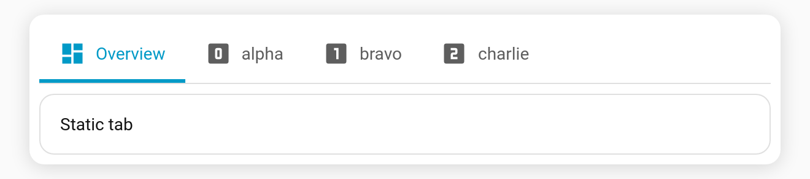

# Dynamic tabs (`auto_tabs`)

Generate a tab **per item** from live Home Assistant data instead of hand-writing them. Point a Jinja template at a list — entities in an area, every camera, a custom list — and Tabdeck builds one tab for each element, keeping them in sync as the list changes.

**Top-level key:** `auto_tabs`

```yaml
type: custom:tabdeck-card
tabs:
  - name: Overview            # static tabs still work; they stay first
    icon: mdi:view-dashboard
    card: { type: markdown, content: All cameras below }
auto_tabs:
  template: >                 # HA Jinja — must return a list
    {{ states.camera | map(attribute='entity_id') | list }}
  tab_template:               # blueprint filled once per list item
    name: "{{ item }}"
    icon: mdi:cctv
    card:
      type: picture-entity
      entity: "{{ item }}"
```

## Options

| Key | Type | Description |
| --- | --- | --- |
| `template` | string (Jinja) | **Required.** Rendered by Home Assistant; must resolve to a **list**. Each element becomes a tab. |
| `tab_template` | tab config | Optional blueprint. When present, it's filled once per list item using the placeholders below. When **absent**, each list element is used directly as a complete tab config. |

## Placeholders (inside `tab_template`)

| Placeholder | Resolves to |
| --- | --- |
| `{{ item }}` | The current list element (a string, or an object). |
| `{{ item.some.prop }}` | A dotted-path lookup when the element is an object, e.g. `{{ item.entity }}`. |
| `{{ index }}` | The 0-based position in the list. |

A placeholder that is the **whole** value keeps the resolved type (so `entity: "{{ item }}"` yields the item itself); a placeholder **inside** a larger string is interpolated as text (`name: "Cam {{ index }}"`).

### Items can be strings or objects

```yaml
auto_tabs:
  template: >
    {{ [
      {'label': 'Front',  'id': 'camera.front_door'},
      {'label': 'Drive',  'id': 'camera.driveway'}
    ] }}
  tab_template:
    name: "{{ item.label }}"
    card: { type: picture-entity, entity: "{{ item.id }}" }
```

### Template returns full tabs (no `tab_template`)

If you omit `tab_template`, the list elements are treated as ready-made tab configs:

```yaml
auto_tabs:
  template: >
    {{ [
      {'name': 'Lights', 'icon': 'mdi:lightbulb', 'card': {'type': 'light', 'entity': 'light.lounge'}},
      {'name': 'Climate', 'card': {'type': 'thermostat', 'entity': 'climate.hall'}}
    ] }}
```

## Behaviour

- **Static first, generated appended.** Existing `tabs:` keep working untouched; generated tabs are added after them. You can also use `auto_tabs` with **no** static `tabs` at all.
- **Live refresh.** When the template result changes (an entity appears/disappears), the tab set rebuilds automatically. Your current tab is preserved by **name** where possible, otherwise the position is clamped into range.
- **Two template layers, kept separate.** `auto_tabs.template` is rendered by Home Assistant. The `{{ item }}` / `{{ index }}` placeholders are resolved **inside the card** — and *only* those tokens. Any other `{{ ... }}` (for example a generated card's own `{{ states('sensor.x') }}` badge) is left untouched and rendered by Home Assistant as normal.
- **Empty / not-ready.** While the template is still rendering, errors, or doesn't return a list, no generated tabs are shown (and a deck with only `auto_tabs` simply shows nothing until the list arrives).
- **No cap.** Large lists are fine — combine with [`scroll_buttons` / `overflow_menu`](Feature-Scroll-Buttons) to handle a long bar.
- Configured in **YAML** (no visual-editor controls), like [`visibility`](Tab-Visibility) and [`auto_select`](Feature-Auto-Select).

## Example

A static **Overview** tab followed by one generated tab per item, with `{{ index }}` driving the icon:


