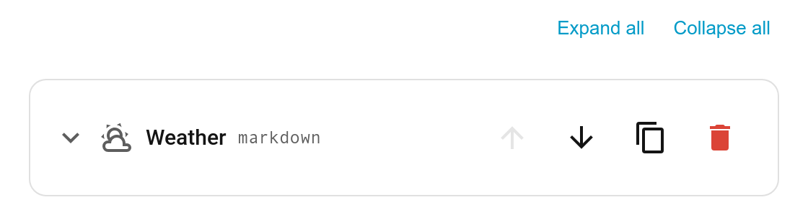

# Expand all / Collapse all (editor)

When a card has more than one tab, the [visual editor](Editor) shows **Expand all** and **Collapse all** links above the tab list, so you can open every tab block at once or tidy them all away.

## Also

- **Adding a tab** now auto-expands the new tab block, so you can configure it straight away (existing open/closed blocks are preserved).
- Individual tab blocks still toggle by clicking their header (or focus + <kbd>Enter</kbd>/<kbd>Space</kbd>) — see [The Visual Editor](Editor).
- Re-ordering or deleting a tab collapses the list (to avoid a stale block staying open on the wrong tab).
