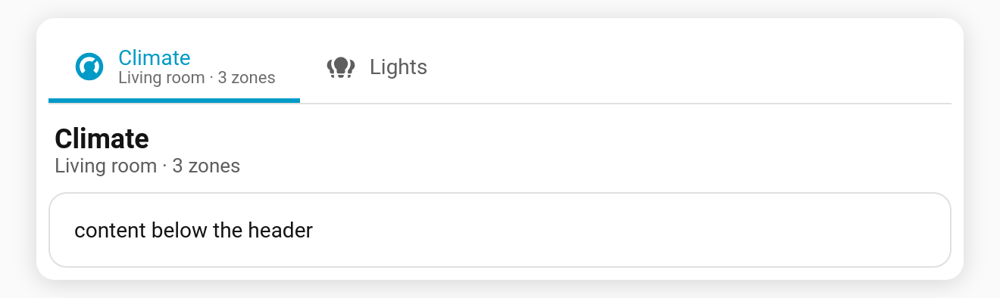

# Content header

Show the **active tab's title** (and [subtitle](Feature-Subtitle)) as a heading strip above the card content — handy when the tab labels are small or icon-only.

**Config key:** `header` (top-level boolean) · **Default:** `false`

```yaml
type: custom:tabdeck-card
header: true
tabs:
  - name: Climate
    subtitle: Living room · 3 zones
    icon: mdi:thermostat
    card: { ... }
```



## Notes

- The header updates as you switch tabs, showing the current tab's `name` and `subtitle`.
- Pairs nicely with [`tab_display: icon`](Feature-Tab-Display) — a compact icon bar plus a clear title above the content.

## Want an icon rail instead?

A narrow vertical icon rail is just `position: left` + `tab_display: icon`:

```yaml
type: custom:tabdeck-card
position: left
tab_display: icon
header: true
tabs: [ ... ]
```
