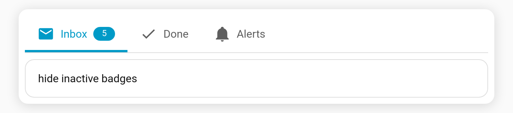

# Hide inactive badges

Only show a [badge](Badges) when it actually has something to report. With **`hide_inactive_badge`**, badges that resolve to an empty/zero/off value are hidden — so a count badge appears only when it's greater than zero.

**Config key:** `hide_inactive_badge` (top-level boolean) · **Default:** `false`

```yaml
type: custom:tabdeck-card
hide_inactive_badge: true
tabs:
  - name: Inbox
    icon: mdi:email
    badge: sensor.unread        # shows "5"
    card: { ... }
  - name: Done
    icon: mdi:check
    badge: sensor.done_count    # "0" -> badge hidden
    card: { ... }
```



## Behaviour

- A badge is hidden when its resolved value is one of (case-insensitive): `""`, `0`, `off`, `false`, `no`, `none`, `unavailable`, `unknown`, `closed`.
- Applies in **text** badge mode. (The [`dot`](Feature-Badge-Display) mode already only shows for active values.)
- Toggle it with the **Hide inactive badges** switch in the [visual editor](Editor).
