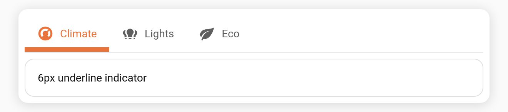

# Indicator thickness

Control how thick the `underline` indicator bar is.

**Config key:** `indicator_size` (top-level number, px) · **Default:** `3` · **Range:** `1`–`16`

```yaml
type: custom:tabdeck-card
style: underline
indicator_size: 6      # thicker underline
tabs: [ ... ]
```



## Notes

- Applies to the `underline` [style](Feature-Bar-Styles). For `pill` / `segmented` / `boxed` the indicator fills the whole tab, so thickness has no effect; `text` has no indicator.
- Values are clamped to `1`–`16`; invalid values fall back to `3`.
- Set it with the **Indicator thickness (px)** slider in the [visual editor](Editor).
- The indicator colour follows [`accent_indicator`](Feature-Accent-Indicator) / per-tab `accent`, or the theme `--primary-color`.
