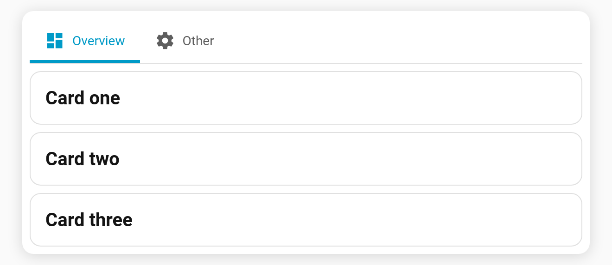
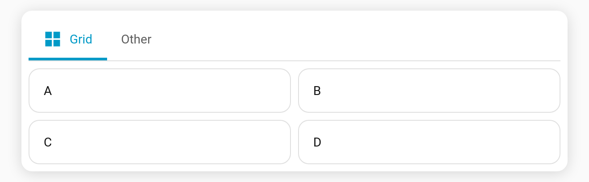

# Multiple cards per tab

A tab normally wraps a single `card`. Use **`cards:`** (a list) instead and Tabdeck stacks them vertically for you — no need to hand-write a `vertical-stack`.

**Per-tab key:** `cards` (list of card configs)

```yaml
type: custom:tabdeck-card
tabs:
  - name: Overview
    icon: mdi:view-dashboard
    cards:
      - type: markdown
        content: "## Card one"
      - type: entities
        entities: [light.kitchen, light.hall]
      - type: gauge
        entity: sensor.power
  - name: Other
    icon: mdi:cog
    card:               # a single card still works
      type: markdown
      content: single
```



## Grid layout with `columns`

Add `columns: N` (N > 1) alongside `cards` to lay them out in a grid instead of a vertical stack:

```yaml
tabs:
  - name: Grid
    icon: mdi:view-grid
    columns: 2
    cards:
      - { type: markdown, content: A }
      - { type: markdown, content: B }
      - { type: markdown, content: C }
      - { type: markdown, content: D }
```



## Notes

- `cards:` is collapsed into a `vertical-stack` card internally (or a `grid` card when `columns > 1`), so it inherits everything (lazy-mount, keep-alive, etc.).
- If both `card` and `cards` are given, **`cards` wins**.
- In the [visual editor](Editor), a tab built this way shows the native **vertical-stack** card editor, where you can add/remove/re-order the sub-cards.
- Want columns instead of a stack? Use a single `card:` of `type: grid` or `horizontal-stack`.
