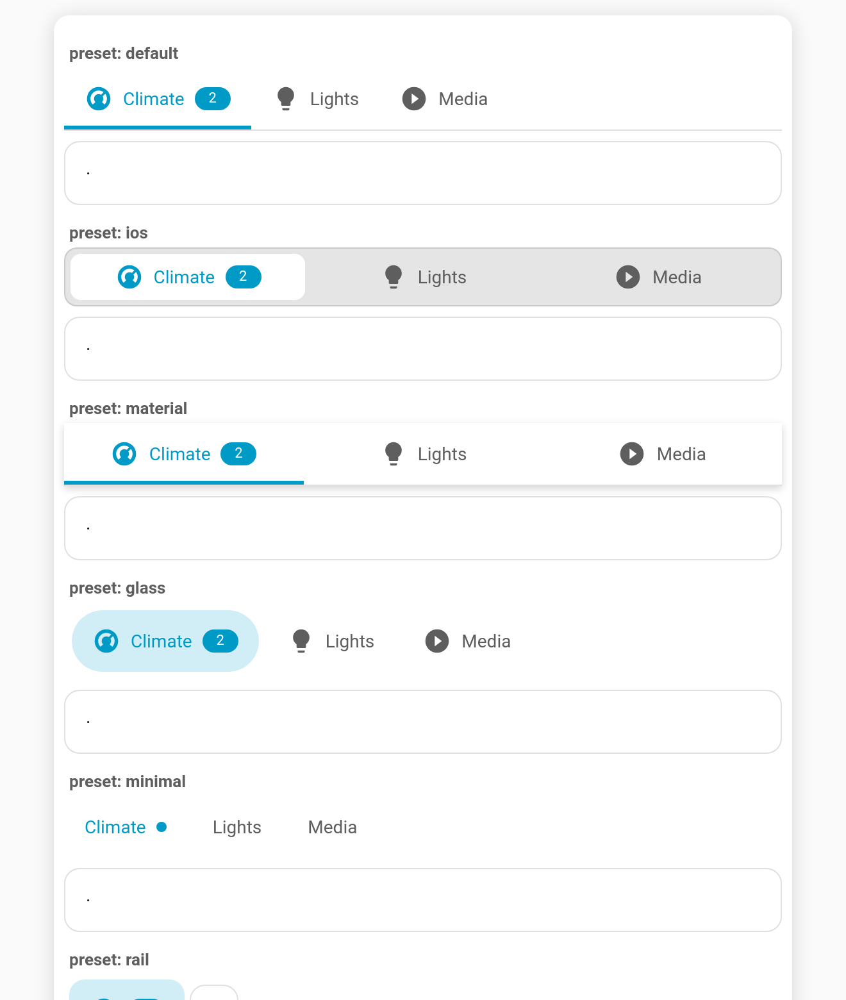

# Style presets

**`preset`** picks a ready-made look in one line. Each preset is a bundle of the existing styling options, so you can still override any of them.

**Config key:** `preset`: `default` | `ios` | `material` | `glass` | `minimal` | `rail`

```yaml
type: custom:tabdeck-card
preset: ios
tabs: [ ... ]
```



| Preset | What it sets |
| --- | --- |
| `default` | The stock look: `underline`, `start`-aligned, `both`. Handy in the editor to reset. |
| `ios` | `segmented` on a grey track, `justify`, 8 px radius, 36 px tabs. |
| `material` | `underline`, `justify`, `elevation`. |
| `glass` | `pill`, `sticky`, translucent frosted bar (`color-mix` background + `--tabdeck-bar-backdrop: blur(12px)`). |
| `minimal` | `text` style, labels only, dot badges. |
| `rail` | `position: left`, `rail` style, icons only. |

Every preset sets the same group of keys: `position`, `style`, `align`, `tab_display`, `badge_display`, `indicator_size`, `indicator_radius`, `elevation`, `sticky`, `bar_background`, plus any preset `styles` variables.

## Overriding

In YAML, anything you set explicitly **wins over the preset**, and `styles` are merged:

```yaml
preset: glass
style: segmented                   # keep glass's frosted sticky bar, but segmented
styles:
  --tabdeck-accent: orange         # merged with glass's --tabdeck-bar-backdrop
```

## In the visual editor

**Style preset** is the first field. Choosing one **writes its values into the fields below** (so you can see and tweak them) and swaps any preset `styles` variables, while keeping your own. Afterwards, editing a field simply overrides it.

## New styling hook

`--tabdeck-bar-backdrop` sets a `backdrop-filter` on the bar (e.g. `blur(12px)`). When a sticky bar has a custom `bar_background`, the area behind it is now transparent, so translucent or blurred bars really show the content scrolling underneath.
