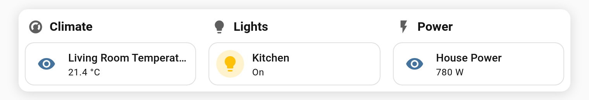
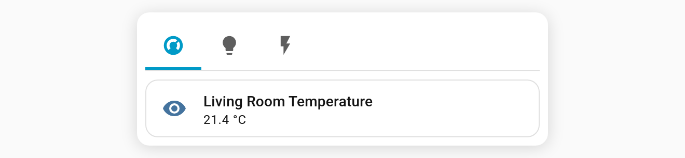

# Responsive layouts: split view & narrow display

The deck can change its layout based on **its own width** (not the screen's), so it adapts to where it sits in a dashboard.

## Split view (`split`)

On a wide card, show **every tab side by side** as titled columns and hide the tab bar. Below the threshold it's a normal tabbed deck again. You get tabs on a phone and columns on a desktop.

```yaml
type: custom:tabdeck-card
split: 900                  # side by side when the card is ≥ 900 px wide
tabs: [ ... ]
```

or with a column count:

```yaml
split:
  min_width: 700
  columns: 3                # 2–4, default 2
```



- Each column gets a title (the tab's icon and name) above its card.
- With more tabs than columns, the extra ones wrap onto further rows.
- [Navigation/action tabs](Feature-Navigation-Tabs) have no content, so they're left out.
- Column spacing is set by `--tabdeck-split-gap` (default `16px`).

## Narrow display (`tab_display_narrow`)

Use a different [tab display mode](Feature-Tab-Display) when the card is narrow. A typical setup is icon-only tabs on phones with icon and label everywhere else.

```yaml
type: custom:tabdeck-card
tab_display: both
tab_display_narrow: icon    # both | icon | label
narrow_width: 450           # "narrow" = card width below this (default 450)
tabs: [ ... ]
```



## Notes

- The width is measured live with a `ResizeObserver`, so layouts switch as you resize the window or change dashboard columns. It's only observed when one of these options is set.
- All options are in the visual editor. The split column count is YAML-only, and it's kept when you change the width in the editor.
