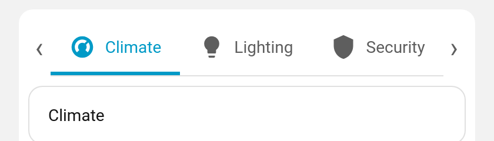
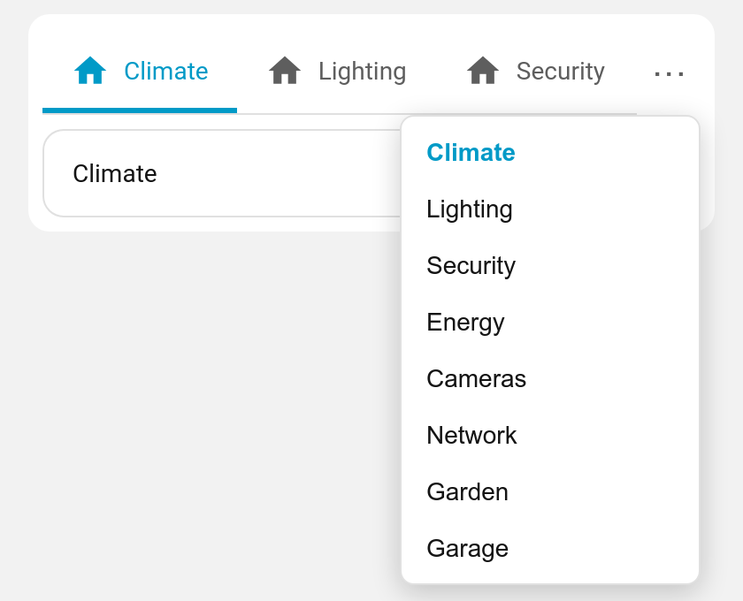

# Scroll buttons

When a horizontal tab bar has more tabs than fit, show **‹ ›** buttons to scroll it (in addition to touch/trackpad scrolling).

**Config key:** `scroll_buttons` (top-level boolean) · **Default:** `false`

```yaml
type: custom:tabdeck-card
scroll_buttons: true
tabs:
  - { name: Climate, icon: mdi:thermostat, card: { ... } }
  - { name: Lighting, icon: mdi:lightbulb, card: { ... } }
  # ...many more...
```



## Behaviour

- The buttons appear **only** when the bar actually overflows (and only for `top`/`bottom` bars).
- Each click scrolls by ~80% of the visible width, smoothly.
- Overflow is re-checked on resize, so the buttons appear/disappear as the card width changes.
- Toggle it with the **Scroll buttons when bar overflows** switch in the [visual editor](Editor).

## Overflow ⋯ menu

Prefer a jump-to-tab list over scrolling? Set **`overflow_menu: true`** instead. When the bar overflows, a **⋯** button appears; clicking it opens a menu of every tab (current one highlighted, disabled tabs greyed) to jump straight to.

```yaml
type: custom:tabdeck-card
overflow_menu: true
tabs: [ ...many... ]
```



You can enable `scroll_buttons` and `overflow_menu` together or independently.
