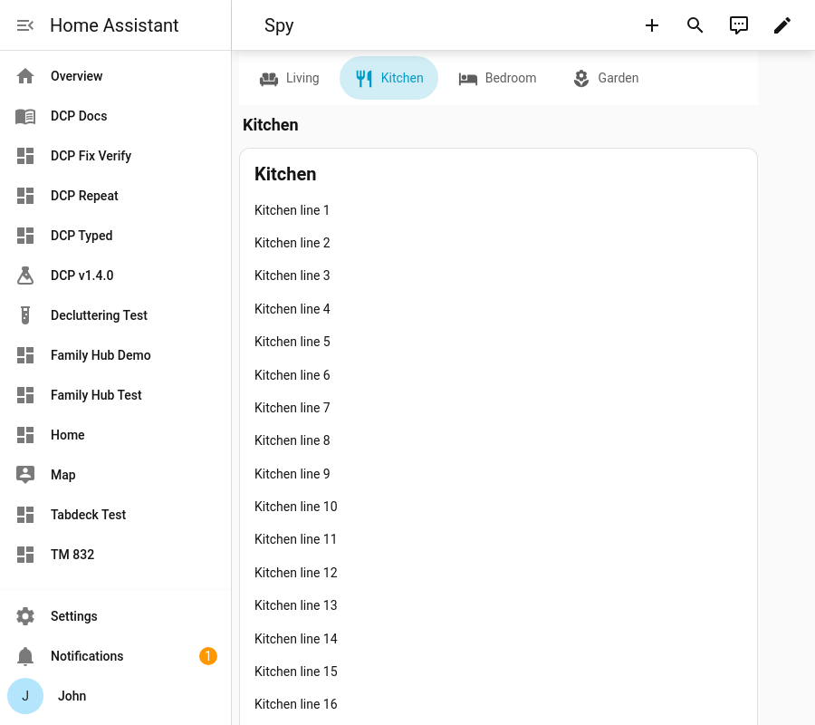

# Scroll-spy (anchor mode)

Set **`scroll_spy: true`** to turn the deck into one long page. Every tab's content is **stacked** as a section:

- tapping a tab **scrolls** to its section, and
- scrolling highlights the tab of the section **in view**.

This suits long single-page dashboards (a room-by-room overview, say) where you still want a jump bar.

**Config key:** `scroll_spy` (top-level boolean) · **Default:** `false`

```yaml
type: custom:tabdeck-card
scroll_spy: true
header: true          # optional: a title above each section
style: pill
tabs:
  - name: Living
    icon: mdi:sofa
    card: { ... }
  - name: Kitchen
    icon: mdi:silverware-fork-knife
    card: { ... }
  - name: Bedroom
    icon: mdi:bed
    card: { ... }
```



## Behaviour

- The bar is automatically **[sticky](Feature-Sticky-Bar)**, pinned below Home Assistant's header.
- The "current" section is the first one crossing a band near the top of the screen (just below the header and the bar).
- A tap scrolls smoothly, and the highlight doesn't flicker through the sections it passes on the way.
- Swipe, [`auto_rotate`](Feature-Kiosk) and live [`remember: entity`](Navigation-and-Persistence#cross-device-with-remember-entity) sync also scroll to their section.
- Selections made by scrolling aren't remembered. Taps are (per `remember`).
- With `header: true`, each section gets its own title and the single content header is dropped.
- Every card is always mounted, so `unmount_hidden` and `transition` don't apply in this mode.

## Styling

| Variable | Default | Effect |
| --- | --- | --- |
| `--tabdeck-spy-offset` | `120px` | Space left above a section when it's scrolled to (HA header + bar). |
| `--tabdeck-sticky-top` | HA header height | Where the pinned bar sits. |
