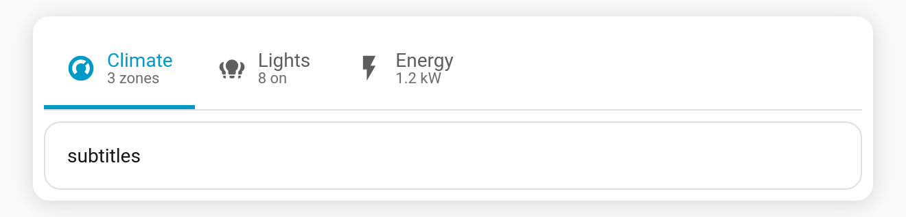

# Tab subtitles

Add a small line of secondary text under a tab's label — handy for a status, count, or hint.

**Per-tab key:** `subtitle` (string)

```yaml
type: custom:tabdeck-card
styles:
  --tabdeck-tab-height: 60px     # give the taller tabs a little room
tabs:
  - name: Climate
    subtitle: 3 zones
    icon: mdi:thermostat
    card: { ... }
  - name: Lights
    subtitle: 8 on
    icon: mdi:lightbulb-group
    card: { ... }
  - name: Energy
    subtitle: 1.2 kW
    icon: mdi:flash
    card: { ... }
```



## Notes

- The subtitle sits under the label in a muted, slightly smaller font.
- It works with any [display mode](Feature-Tab-Display) that shows the label (`both`/`label`); in `icon`-only mode the subtitle is hidden along with the label.
- Subtitles make tabs taller — bump [`--tabdeck-tab-height`](Feature-Theming) if they feel cramped.
- For a *dynamic* subtitle, set a [template](Badges) — or use a [badge](Badges) instead if you only need a count.
- Set it from the **Subtitle** field in the [visual editor](Editor).
