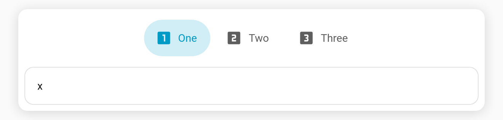
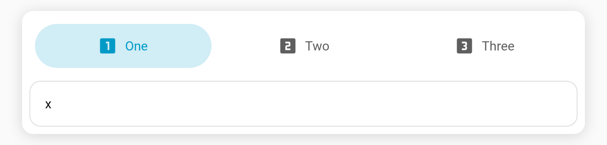

# Tab alignment

Control how the tabs are distributed along the bar.

**Config key:** `align` (top-level) · **Values:** `start` (default) · `center` · `end` · `justify`

```yaml
type: custom:tabdeck-card
align: justify     # start | center | end | justify
style: pill
tabs: [ ... ]
```

| Value | Result |
| --- | --- |
| `start` | Tabs packed at the start (default). |
| `center` | Tabs centred in the bar. |
| `end` | Tabs packed at the end. |
| `justify` | Tabs stretch to share the full width equally. |





## Notes

- Works with every bar [style](Feature-Bar-Styles) and [position](Configuration). For vertical (`left`/`right`) bars it distributes the tabs along the column.
- With a [scrollable](Configuration) bar that overflows, alignment has no visible effect (the bar scrolls instead).
- Pick it from the **Tab alignment** dropdown in the [visual editor](Editor).
