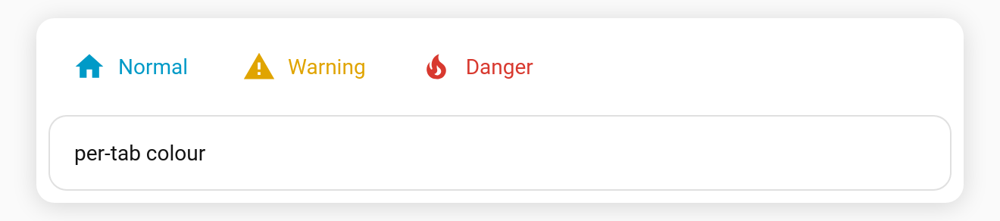

# Per-tab text/icon colour

Give a single tab a fixed colour for its **label and icon**, independent of the selection accent. Handy for "Warning"/"Danger" style tabs that should always stand out.

**Per-tab key:** `color` (CSS colour)

```yaml
type: custom:tabdeck-card
style: text
tabs:
  - name: Normal
    icon: mdi:home
    card: { ... }
  - name: Warning
    icon: mdi:alert
    color: "#e0a400"
    card: { ... }
  - name: Danger
    icon: mdi:fire
    color: "#d8392f"
    card: { ... }
```



## Behaviour

- `color` sets the tab's label **and** icon colour in **every** state (it overrides the selected-tab accent colour for that tab).
- It does **not** change the indicator — the indicator still follows [`accent`](Feature-Accent-Indicator). So you can have, e.g., a red "Danger" label with the normal accent underline.
- Set it from the **Text/icon colour** field in the [visual editor](Editor).
