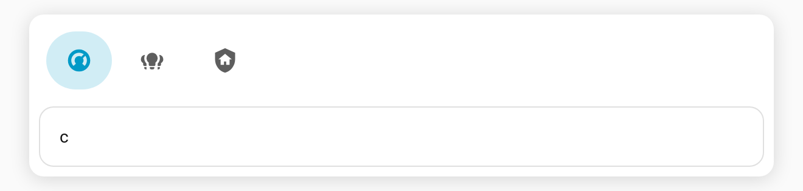

# Tab display mode

Choose whether the tab bar shows **icons, labels, or both**. Great for compact bars on mobile or icon-driven dashboards.

**Config key:** `tab_display` (top-level) · **Values:** `both` (default) · `icon` · `label`

```yaml
type: custom:tabdeck-card
tab_display: icon      # both | icon | label
style: pill
tabs:
  - name: Climate
    icon: mdi:thermostat
    card: { type: thermostat, entity: climate.living_room }
  - name: Lights
    icon: mdi:lightbulb-group
    card: { type: entities, entities: [light.kitchen] }
  - name: Security
    icon: mdi:shield-home
    card: { type: entities, entities: [alarm_control_panel.home] }
```



## Behaviour

| Value | Shows |
| --- | --- |
| `both` | Icon **and** label (the classic look). |
| `icon` | Icon only — but a tab **with no icon** still shows its label, so a tab is never empty. |
| `label` | Label only; icons are hidden. |

Set it globally in the card config, or pick it from the **Tab display** dropdown in the [visual editor](Editor).

## Tips

- Pair `tab_display: icon` with the `pill` or `segmented` [style](Configuration) for a clean app-style switcher.
- Give every tab an `icon` when using `icon` mode so the bar stays consistent.
