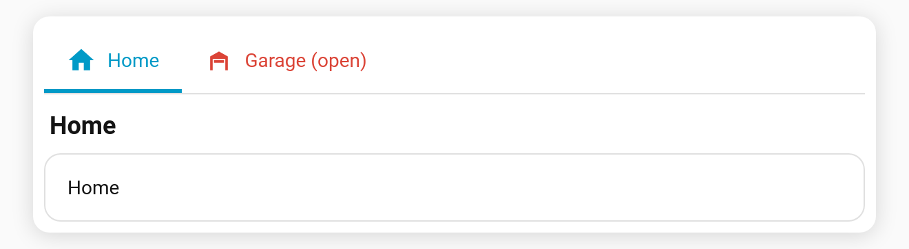

# State-driven icons, names & colours

A tab's **`icon`**, **`name`**, **`subtitle`**, **`color`** and **`accent`** can each be a Home Assistant **Jinja template**. Home Assistant renders it and the tab updates live as states change. For example, a garage tab can show an open-door icon in red while the door is open.

**Per-tab keys:** `icon`, `name`, `subtitle`, `color`, `accent`. Any value containing `{{` or `{%` is treated as a template.

```yaml
type: custom:tabdeck-card
tabs:
  - name: >-
      {{ 'Garage (open)' if is_state('cover.garage_door', 'open') else 'Garage' }}
    icon: >-
      {{ 'mdi:garage-open' if is_state('cover.garage_door', 'open') else 'mdi:garage' }}
    color: >-
      {{ 'var(--error-color)' if is_state('cover.garage_door', 'open') else '' }}
    card:
      type: tile
      entity: cover.garage_door
  - name: Climate
    subtitle: "{{ states('sensor.living_room_temperature') }} °C"
    icon: mdi:thermostat
    card: { ... }
```



## Behaviour

- Templates are rendered **server-side** over the websocket (the same engine as [template badges](Badges#template-badge)), and update the moment their inputs change.
- An **empty** result (e.g. the `else ''` branch above) counts as *unset*: `color` falls back to the normal colour, and `icon` shows no icon.
- While a template is still rendering (the first moment after load), the field is treated as unset.
- Plain strings (no `{{`/`{%`) behave exactly as before, and nothing is subscribed.
- The [content header](Feature-Header) shows the rendered name and subtitle.

## Caveats

- `remember: url` and `default_tab: <name>` match the tab's **configured** name. If you use either with a templated name, prefer an index (`default_tab: 1`, `#tab=1`).
- The editor's live preview shows templated fields as placeholders. They render on the dashboard.
