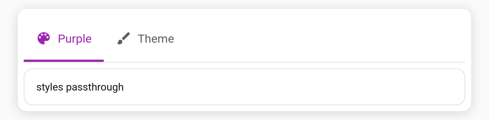

# Theming & the `styles` passthrough

Tabdeck reads several CSS custom properties and lets you set them (and any other CSS variables) directly from the card config via **`styles`** — no `card-mod` required.

**Config key:** `styles` (top-level map of CSS property → value)

```yaml
type: custom:tabdeck-card
styles:
  --tabdeck-accent: "#9c27b0"
  --tabdeck-tab-height: 64px
  --tabdeck-tab-font-size: 16px
tabs: [ ... ]
```



## Supported CSS variables

| Variable | Affects | Default |
| --- | --- | --- |
| `--tabdeck-accent` | Indicator / selected tab colour | `--primary-color` |
| `--tabdeck-tab-height` | Tab bar height | `48px` |
| `--tabdeck-tab-font-size` | Tab label size | `14px` |

The card also honours standard HA theme variables (`--primary-color`, `--divider-color`, `--card-background-color`, `--secondary-text-color`, …).

## How `styles` works

- Each entry is applied as a custom property (or any CSS property) on the card host.
- Entries are reconciled on config change, so removing a key clears it.
- Per-tab [`accent`](Feature-Accent-Indicator) still overrides `--tabdeck-accent` for the selected tab.

> `styles` is YAML/advanced — it isn't shown in the visual editor, but it's fully supported and round-trips through the code editor.
